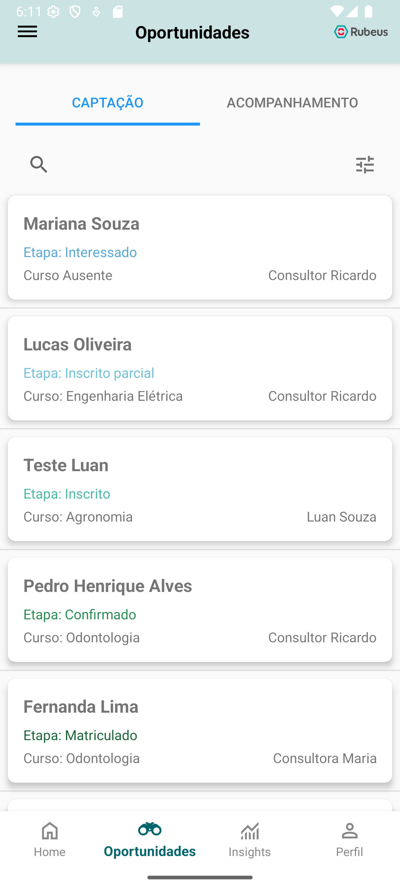

# Commercial Monitoring App

This project was developed as part of the **Mobile Development** course at the **Federal University of Viçosa (UFV)**, in collaboration with the **RUBEUS** company.

## 📱 About the App

**Commercial Monitoring App** is a CRM mobile application designed to assist consultants and staff from educational institutions in monitoring and managing new client opportunities more efficiently. The app provides a user-friendly interface for:

- Tracking new opportunities (potential students)
- Managing opportunities efficiently
- Viewing personal activities and schedules
- Gaining insights into performance and engagement

All student data displayed in this app is fictitious and used for educational purposes only.

---

## 🖼️ App Screenshots

| Home                         | Opportunities               |
|-----------------------------|-----------------------------|
|     |  |

| Client Profile               | Performance Insights        |
|-----------------------------|-----------------------------|
| |  |

| User Profile                 |
|-----------------------------|
|  |

---

